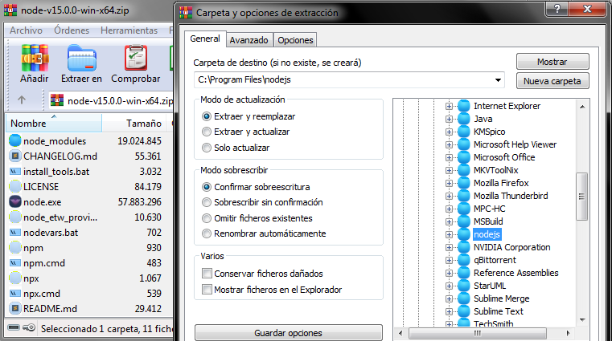
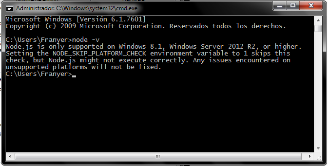
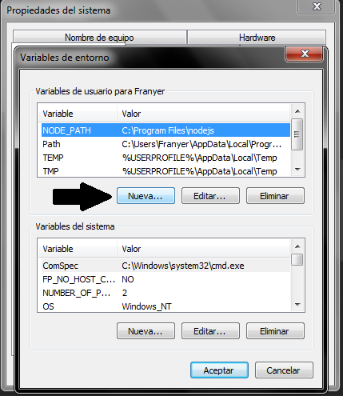
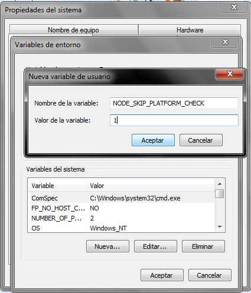

# Configuración Personal de Sublime Text 4

![logo][logo]
![editor][editor]

---

## Requisitos

- **GIT** para windows de [32][git32] o [64 bits][git64] agregado a `PATH`.
Puedes verificar si está instalado y agregado a PATH introduciendo el
comando:

		> git -v
		git 2.40.1.windows.1

- **NodeJS** para windows de [32][node32] o [64 bits][node64]

	> **IMPORTANTE:** Los enlaces compartidos arriba son instaladores
	para `NodeJS v.13.14` la cual es la última versión que tiene soporte
	en Windows 7.
	
	> **Si quieres tener los paquetes de LSP para Sublime Text**, deberás tener
	como **mínimo la versión 15 de NodeJS**. Sin embargo esta versión no se puede instalar
	directamente en Windows 7. Por lo que si tienes Windows 8 o Windows 10
	puedes saltarte los siguientes pasos y sólo visitar [La web oficial de NodeJS](https://nodejs.org)
	para obtener la última versión.
	
	> **[Instalar NodeJS versión 15 en Windows 7](#instalar-nodejs-version-15-en-windows-7)**

---

## Package Control y Plugins

> Recomiendo hacer la configuración con Sublime Text 4
recién instalado y sin ninguna configuración que no sea
opcionalmente introducir la licencia.

### Package Control

1. En el menú superior abre la sección **`Tools`**.
2. Selecciona **`Install Package Control...`**

> Para comprobar que ya está instalado puedes abrir
el menú **`Preferences`** y debería estar la opción
**`Package Control`**.

### Extensiones, temas y plugins

> Una vez instalado Package Control, teclea la combinación
`CTRL + SHIFT + P` y escribe `install` y selecciona la opción
**`Package Control: Install Package`**, a continuación, instala
una a una las siguientes extensiones.

#### A File Icon
#### AdvanceNewFile
#### Alignment
#### All Autocomplete
#### ApacheConf
#### AutoFileName
#### AutoPrefixer
#### ayu
#### BracketHighlighter
#### ColorHelper
#### Console Wrap
#### CSS Extended Completions
#### DocBlockr
#### DotENV
#### Emmet
#### Git
#### Git badges like VS Code
#### GitGutter
#### Handlebars
#### HTML Mustache
#### INI
#### Laravel Blade Highlighter
#### LESS
#### LiveReload
#### LSP
#### LSP-bash
#### LSP-clangd
#### LSP-css
#### LSP-eslint
#### LSP-file-watcher-chokidar
#### LSP-golsp
#### LSP-html
#### LSP-intelephense
#### LSP-jdtls
#### LSP-json
#### LSP-lemminx
#### LSP-marksman
#### LSP-OmniSharp
#### LSP-pylsp
#### LSP-pyright
#### LSP-ruff
#### LSP-stylelint
#### LSP-tailwindcss
#### LSP-typescript
#### MarkdownPreview
#### Material Theme
#### Minify
#### Nette + Latte + Neon
#### Nix
#### phpfmt
#### Pug
#### QuickView
#### RainbowBrackets
#### Razor C# Syntax
#### RegexMatch
#### REST Client
#### Sass
#### SideBarEnhancements
#### Smarty
#### SQLTools
#### Stylus
#### subl-comment-snippets
#### SublimeLinter
#### SublimeLinter-coffee
#### SublimeLinter-contrib-phpstan
#### SublimeLinter-contrib-sass-lint
#### SublimeLinter-pug-lint
#### Super Calculator
#### SVG Preview
#### Tailwind CSS
#### Terminus
#### Theme - Adaptify
#### Theme - City Lights
#### Theme - Gravity
#### TrailingSpaces
#### Visual Studio Code Plus Scheme

---

### Pasos Finales

Habiendo instalado todos los plugins,
descartad el que no les guste leyendo la
documentación del propio plugin, aunque
los recomiendo todos para convertir
Sublime Text 4 en un potente IDE a las alturas
modernas.

**DESDE SUBLIME TEXT 4** ve al menú `PREFERENCES` y luego
a `Browse Packages`. Haz click derecho en esta
carpeta y luego en `Git Bash here`.

Primero introduce el comando `RD /S /Q User`

Luego introduce el comando `cd ..`

y luego el comando:

		git clone https://github.com/fadrian06/sublime-config.git .

Vuelve a abrir Sublime Text 4 y las configuraciones
se deberían haber aplicado correctamente. Disfruta! :D

---

## Pasos adicionales

### Instalar NodeJS versión 15 en Windows 7

Los instaladores automáticos de NodeJS versión 15 no funcionan en
Windows 7, primero instala NodeJS versión 13.14 usando los enlaces
descritos en la sección [Requisitos](#requisitos)

Una vez instalado Node 13 puedes introducir el siguiente comando para
asegurarte que funciona correctamente:

		> node -v
		v13.14.0

Descarga los comprimidos de **Node 15** para [32][node15x86] o [64 bits][node15x64]

Descomprime los archivos *node_modules, node.exe, ...* en el directorio donde Node 13
se encuentra instalado, que comúnmente es `C:/Archivos de Programa/nodejs/`

> **SI SOLICITA Reemplazar** aceptar el reemplazar todos los archivos.

Ahora vuelve a escribir el comando `node -v` y verás que lanza un error.

Para solucionar este error, vea los siguientes 7 pasos:

---

1. Haz clic en el **menú de inicio** de Windows,
luego haz clic derecho en **Equipo** y selecciona la opción **Propiedades**:

![1][imgNode151]

2. Seguidamente, haz clic en **«Configuración avanzada del sistema»**:

![2][imgNode152]

3. En la pestaña de **opciones avanzadas**, debes hacer clic en la opción **«Variables de entorno»**:

![3][imgNode153]

4. En el panel de **variables del sistema**, haz clic en Nueva:

5. Crea la siguiente **variable de entorno**: **`NODE_SKIP_PLATFORM_CHECK`** y asignale el valor **1**.

6. Haz click en **Aceptar** en todas las ventanas abiertas.

7. Vuelve a introducir el comando **`node -v`** y ya debería estar funcionando.
**Podría ser necesario reiniciar el sistema**.

		> node -v
		v15.0.0

---

<a
	href="#configuracion-personal-de-sublime-text-4"
	style="
		display: block;
		width: 100%;
		padding: 10px;
		background: indigo;
		color: white;
		text-align: center;
		border-radius: 10px;
		font-weight: bold
	">Ir al inicio
</a>

<!-- Referencias -->
[logo]: https://www.easyappcode.com/upload/post-716768416.jpg
[editor]: https://www.unixtutorial.org/images/posts/sublime-text-4.png
[git32]: https://github.com/git-for-windows/git/releases/download/v2.40.1.windows.1/Git-2.40.1-32-bit.exe
[git64]: https://github.com/git-for-windows/git/releases/download/v2.40.1.windows.1/Git-2.40.1-64-bit.exe
[node32]: https://nodejs.org/dist/v13.14.0/node-v13.14.0-x86.msi
[node64]: https://nodejs.org/dist/v13.14.0/node-v13.14.0-x64.msi
[node15x86]: https://nodejs.org/dist/v15.0.0/node-v15.0.0-win-x86.zip
[node15x64]: https://nodejs.org/dist/v15.0.0/node-v15.0.0-win-x64.zip

[imgNode151]: https://www.neoguias.com/wp-content/uploads/2020/07/agregar-directorio-path-windows-7-01-508x269.png
[imgNode152]: https://www.neoguias.com/wp-content/uploads/2020/07/agregar-directorio-path-windows-7-02-508x274.png
[imgNode153]: https://www.neoguias.com/wp-content/uploads/2020/07/agregar-directorio-path-windows-7-03.png